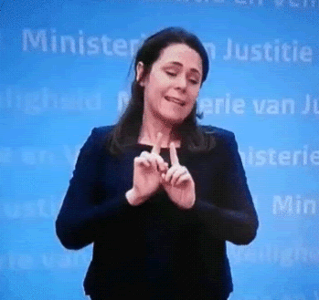
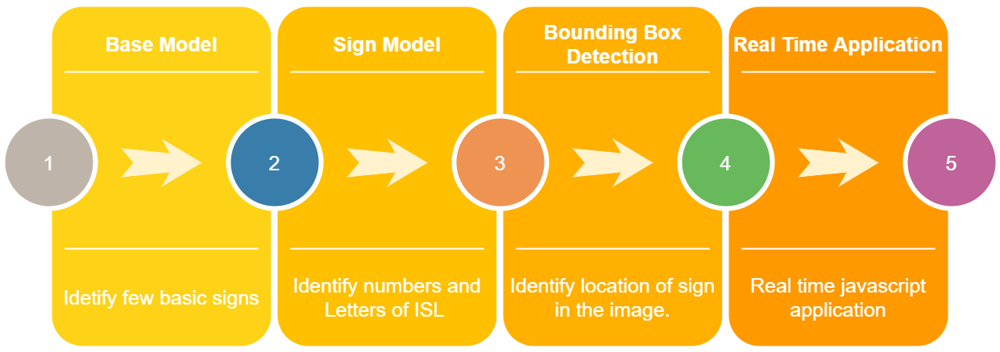
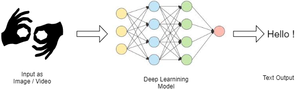

## Project Proposal

### Motivation
Around **466 million people** worldwide have disabling hearing loss. They use sign language to communicate with themselves and with the entire world. Sign language is composed of visual gestures and signs, which are used by deaf and mute for their
talking. There are **143 existing different sign languages** all over the world, mainly American Sign Language (ASL), British Sign Language, French SignLanguage, Japanese Sign Language, and Indian Sign Language (ISL).  The vast majority live in low- and middle-income countries where they often do not have access to appropriate ear and hearing care services.
In India  there are only about **250 Sign Language interpreters** in the entire country for as many as **18 million deaf Indians**. About **98% of them illiterate** and 2% have managed to pass class 10th.  Literacy among the deaf is **5-10 percent where 5 percent of them know English**. 20-30% can communicate in some form of sign language. The vast majority of the Indian Deaf (about 76-89%) have limited signing ability. Many only have a gesture system. There is hardly anything they learn in deaf school from class 1st-12th as the teachers focus on oralism. There are no colleges for the deaf in India, children are stuck after completing their schooling.Without adequate education most Deaf lack good communication skills to be employed; thus, many Deaf are without work. 

Deaf community remains so cut off from our society. We are too far from what can be said an inclusive society !! 

The aim of our project is to provide more opportunities to the deaf people and make them a part of our society. We aim to develop a system that helps real time recognition so they can communicate with the other people and feel inclusive in the society and have proper education and can grow in life.  
There has been a lot of work1 already done on ASL recognition as it is a widely learnt language all over the globe. Indian Sign Language, which is at a premature state and due to which few attempts that try to convert speech to sign and sign to speech have failed. ASL uses a single hand in the gesture representation and it is simple compared to ISL. ISL uses both the hands for gesture representation and it is complex compared to ASL. Because of this reason, there is less research and development in this field. 

### Final Aim / Ideas

Recognition task - In this project we aim to develop a real time captioner of Indian Sign Language (ISL) without any direct human intervention. For this task we want to build a recognizer to identify patterns of ISL and Caption it in real time.

Dream ( Not Something we can achieve in this course but contribute in this direction)
We wish to see a deaf person doing a presentation using sign language and the audience is able to understand it through sound/voice. Recognizing sign language is the bottleneck here other aspects are trivial/already done to fulfil this dream.

### Difficulties that we may have to oversee during this project -
Recognition of Words that uses facial expression and motion of hands simultaneously is a difficult task to achieve
Lack of Labelled data is another situation that we have to overcome 
To train the models with higher accuracy we need to find huge datasets
Higher Accuracy of image classification is difficult to achieve with many overlapping signs/symbols
Local variations in sign language makes it difficult to create a robust model
Plan 
There are many things to be done in this domain. For our project we aim to aim a step to improve current ISL systems. In this project we plan to answer these questions?
“What are the current SoTA systems for sign language recognition of ISL? In what ways can we improve to reach near the ASL technology and what are the major challenges ?”
We will explore this problem and aim to make a real-time recognition system for ISL signs. By the end of the project we also aim to make a real time sign recognition system for ISL.

Check Points. ( I cannot think of a timeline)

To go to build the final models will be a very difficult task. Referring the spiral technique to develop our project, we came up with a series of milestones that we aim to achieve as we proceed with our project. Coming up with a timeline is difficult for us, as we don’t have enough expertise to even say we can achieve all aims.

### Checkpoints for our model
- Classification of some basic signs. (To learn Pytorch and so).
- Build a model to classify just letters or just alphabets! (Where hands have to be in a specified box)
- Model for letters and alphabets both! (Where hands have to be in a specified box)
- Try detecting the location of the hand in a full photo, and get the bounding box. (Once done the previous models in aim 1,2,3 can be directly applied)
- Create a real time system for each! (laptop webcam)
- Make it work with just a phone camera !!

We are not sure how many milestones we will be able to achieve. But, at the end of the project we aim to have:
- Answer to the question we started with ?
- Have a working real time system to detect signs of ISL. 

### Methodology 

  * Data Curation:
    * Collect data from Youtube videos.
    * Learn ISL and take our own pictures.
    * Talk to people familiar with ISL to gain more data.
  * Model building 
    * We plan to CNN architecture to build image classification models.
  * Building real time application
    * We plan to use pytorch or Tensorflow js modules to build a web application that does real time inference.

### Refernces
  Indian Sign Language Character Recognition, Sravani et al. [Link](https://www.iosrjournals.org/iosr-jce/papers/Vol22-issue3/Series-1/B2203011419.pdf) 

